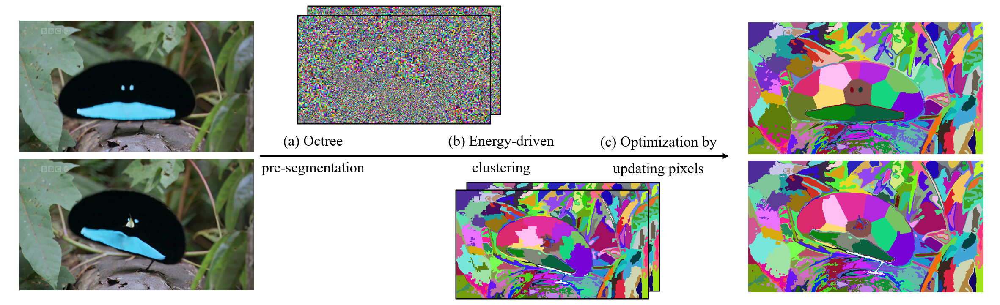

# Adaptive Video Supervoxel Segmentation via Energy-Guided Bottom-Up Clustering


We provide the source code that tested on Windows for the paper: 
> **Adaptive Video Supervoxel Segmentation via Energy-Guided Bottom-Up Clustering**
>

## Runtime Environment 
```
The project requires: OpenGL 4.2 or later; Eigen library; OpenCV with GPU support.

The GLFW3 is provided in the project, you need to download Eigen to the "includes" dir, and install OpenCV with Cuda support.
```
## Parameters 
```
Specify the paths of input dataset and the output file in main.cpp.

The program generates supervoxel segmentation results, including txt files and pseudo-color images.

Download the video datasets (SegTrackv2, BuffaloXiph) provided in LIBSVXv4.0: http://www.cs.rochester.edu/~cxu22/d/libsvx/
```
## License
```
The codes in this repository are under the GNU AFFERO GENERAL PUBLIC LICENSE as specified by the LICENSE file.
```
